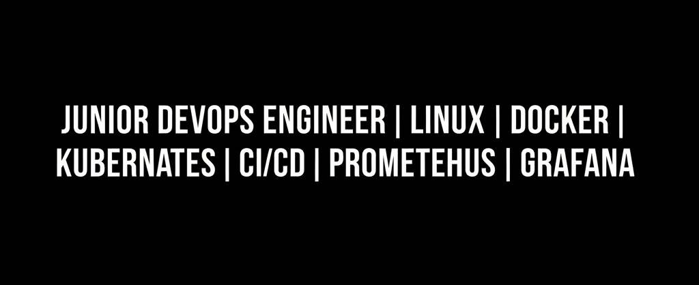
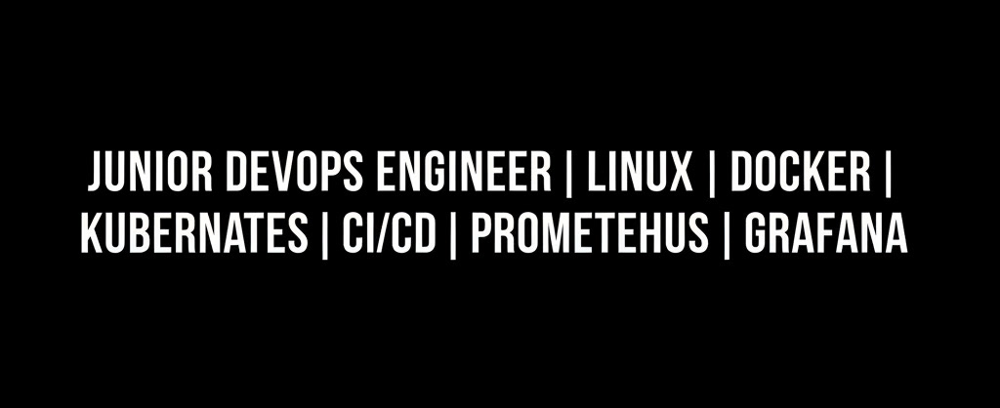

## 🇬🇧 English

# Hi, I'm Georgiy (GansGanrnett) 👋

### 🚀 Junior DevOps Engineer

Aspiring DevOps Engineer. I can set up Linux servers, deploy applications with Docker and Kubernetes, configure CI/CD and monitoring. Looking for a Junior DevOps position to apply automation and containerization skills.

---

### 🛠️ My Stack

---

### 📌 Featured Project

[**docker-project**](https://github.com/GansGanrnett/docker-project) — Polyglot microservices cluster with CI/CD, Prometheus + Grafana monitoring, and RSA encryption.

---

### 📫 How to reach me

- GitHub: [GansGanrnett](https://github.com/GansGanrnett)
- Email: *gansgarnett@gmail.com*
- Telegram: *@georgeTd21*

---

## 🇷🇺 Русский

# Привет, я Georgiy (GansGanrnett) 👋

### 🚀 Junior DevOps инженер

Начинающий DevOps-инженер. Умею поднимать серверы на Linux, разворачивать приложения через Docker и Kubernetes, настраивать CI/CD и мониторинг. Ищу позицию Junior DevOps, где смогу применять навыки автоматизации и контейнеризации.

---

### 🛠️ Мой стек

---

### 📌 Избранный проект

[**docker-project**](https://github.com/GansGanrnett/docker-project) — Полиглотный микросервисный кластер с CI/CD, мониторингом Prometheus + Grafana и RSA-шифрованием.

---

### 📫 Как со мной связаться
- GitHub: [GansGanrnett](https://github.com/GansGanrnett)
- Email: *gansgarnett@gmail.com*
- Telegram: *@georgeTd21*
- 
